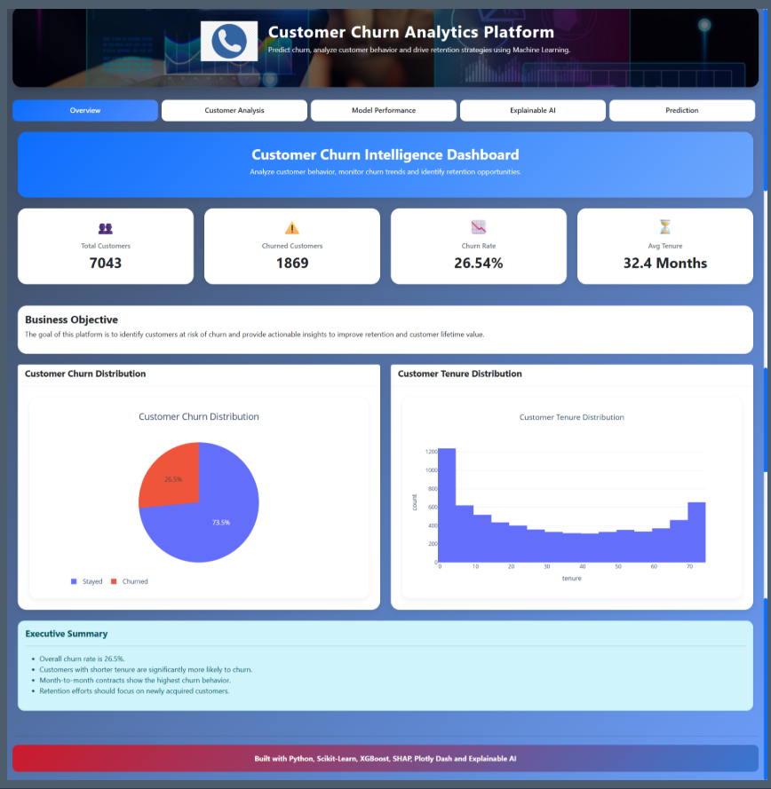
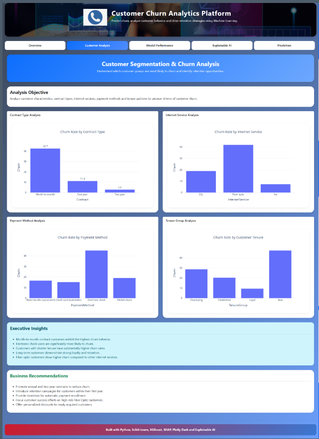
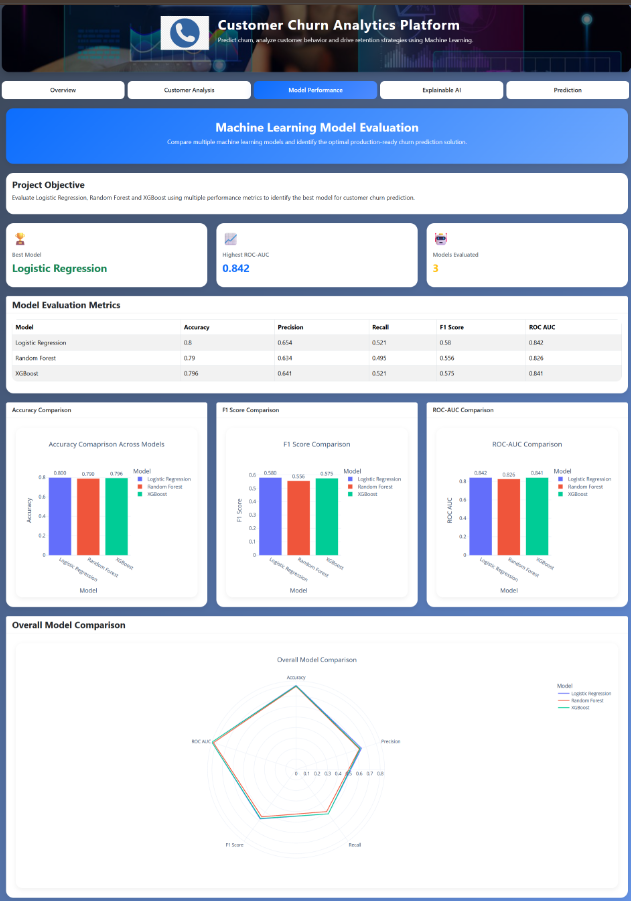
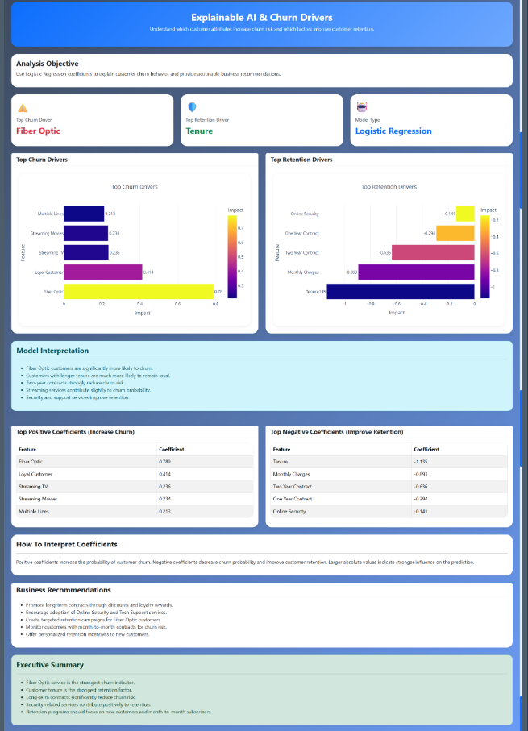
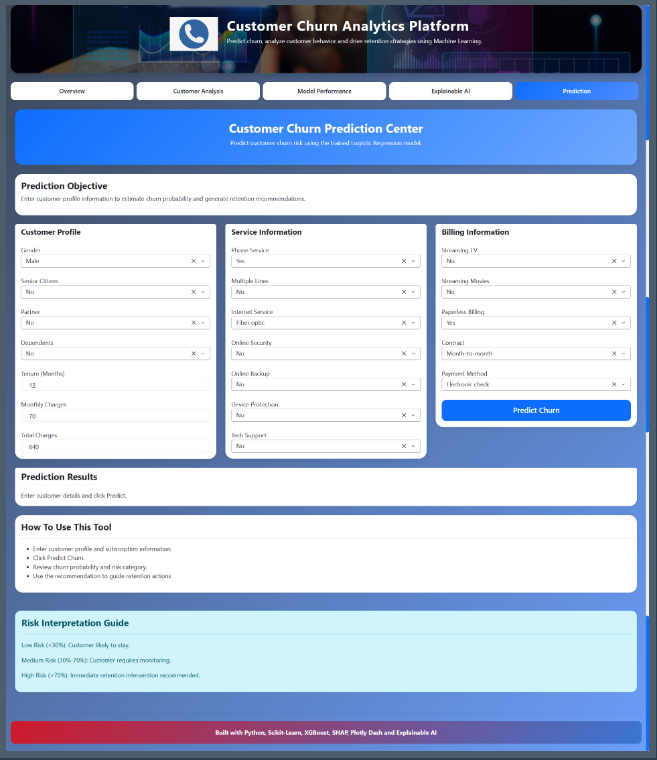

# 📊 Customer Churn Prediction & Business Intelligence Platform

🚀 Live Demo:
https://your-app-name.onrender.com

## Project Overview

Customer churn is one of the most critical business challenges faced by subscription-based companies such as telecom providers, SaaS businesses, banks, and e-commerce platforms.

This project aims to identify customers who are likely to leave a service using machine learning and business intelligence techniques.

The solution combines:

* Data Cleaning & Preprocessing
* Exploratory Data Analysis (EDA)
* Feature Engineering
* Churn Prediction Models
* Explainable AI (SHAP)
* Interactive Dashboard Development

---

## Business Problem

Customer acquisition is significantly more expensive than customer retention.

The objective is to predict which customers are at risk of churn so businesses can proactively take retention actions.

---

## Project Goals

* Analyze customer behavior and churn patterns
* Identify key factors driving churn
* Build predictive machine learning models
* Compare multiple classification algorithms
* Explain model predictions using SHAP
* Develop an interactive BI dashboard

---

## Dataset

Dataset: IBM Telco Customer Churn

Target Variable:

```text
Churn
```

Values:

```text
Yes
No
```

---

## Tech Stack

### Programming

* Python

### Data Analysis

* Pandas
* NumPy

### Visualization

* Matplotlib
* Seaborn
* Plotly

### Machine Learning

* Scikit-Learn
* XGBoost

### Explainability

* SHAP

### Dashboard

* Dash
* Dash Bootstrap Components

---

## Planned Project Workflow

### Phase 1: Data Preparation

* Data Collection
* Data Cleaning
* Missing Value Handling
* Data Type Conversion

### Phase 2: Exploratory Data Analysis

* Churn Distribution
* Customer Demographics
* Contract Analysis
* Revenue Analysis
* Correlation Analysis

### Phase 3: Feature Engineering

* Customer Segmentation
* Revenue Features
* Tenure Features
* Service Usage Features

### Phase 4: Machine Learning

Models:

* Logistic Regression
* Random Forest
* XGBoost

Evaluation Metrics:

* Accuracy
* Precision
* Recall
* F1 Score
* ROC-AUC

### Phase 5: Explainable AI

* Feature Importance
* SHAP Analysis

### Phase 6: Dashboard

Dashboard Pages:

* Overview
* Customer Analytics
* Churn Insights
* Model Performance
* Churn Prediction

---

## Project Structure

```text
Customer_Churn_Prediction/

├── data/
│   ├── raw/
│   └── processed/
│
├── notebooks/
│   ├── EDA.ipynb
│   └── Modelling.ipynb
│
├── models/
│
├── src/
│   ├── check_dataset.py
│   ├── data_preprocessing.py
│   ├── feature_engineering.py
│   └── model_preparation.py
│
|
├── images/
│   ├── overview.png
│   ├── cuatomer_analysis.png
│   ├── model_performance.png
│   ├── expalin_AI.png
│   └── prediction.png
|
|
├── dashboard/
│   ├── pages/
|        ├── overview.py
│        ├── customer_analyis.py
│        ├── model_performance.py
│        ├── explainability.py
│        └── prediction.py
│   ├── assets/
│   └── utils/
|   ├── app.py
│
├── requirements.txt
├── README.md
```
---

## Dashboard Preview

### Overview



### Customer Analysis



### Model Performance



### Explainable AI



### Prediction



---

## 🚀 Project Status

| Module | Status |
|----------|----------|
| Data Preprocessing | ✅ Completed |
| Exploratory Data Analysis | ✅ Completed |
| Feature Engineering | ✅ Completed |
| Model Preparation | ✅ Completed |
| Logistic Regression | ✅ Completed |
| Random Forest | ✅ Completed |
| XGBoost | ✅ Completed |
| Explainable AI | ✅ Completed |
| Dashboard Development | ✅ Completed |
| Deployment | ✅ Completed |

---

## 🔮 Future Enhancements
* Customer Segmentation using Clustering
* Automated Retraining Pipeline
* Real-Time Data Integration
* Cloud-Based Model Monitoring
* Customer Lifetime Value Prediction
---

## Author

Abhilash Kumar

Aspiring Data Scientist | Machine Learning Enthusiast | Data Analytics Professional

Skills:

Python • SQL • Power BI • Machine Learning • Data Visualization • Dashboard Development • Statistical Analysis

---

⭐ If you found this project useful, consider giving it a star on GitHub.
