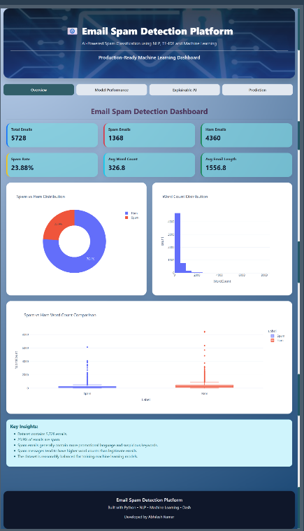
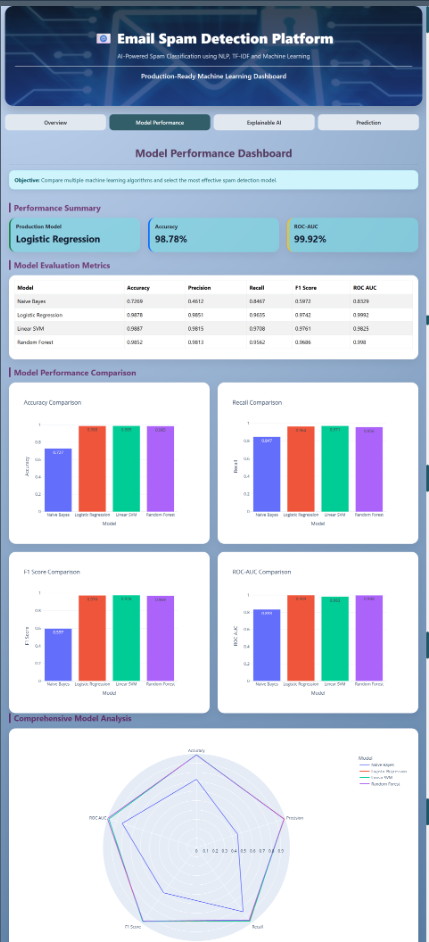
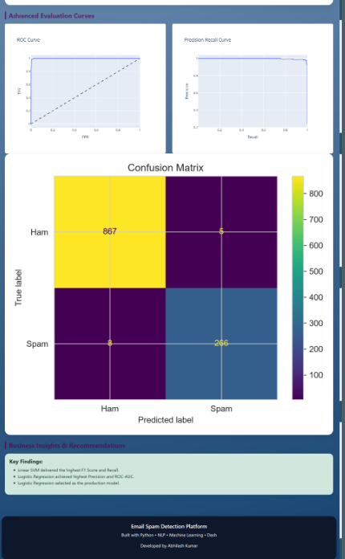
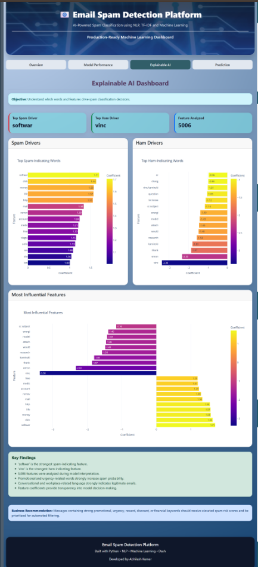
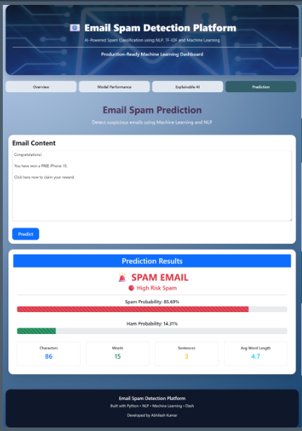

# 📧 Email Spam Detection System using Machine Learning & NLP

🚀 Live Demo:
https://customer-churn-dashboard-f28f.onrender.com/

## 📌 Project Overview

This project is an end-to-end Email Spam Detection System that uses Natural Language Processing (NLP) and Machine Learning to automatically classify emails as Spam or Ham (Legitimate Email).

The project includes:

* Data Preprocessing Pipeline
* Exploratory Data Analysis (EDA)
* Feature Engineering
* TF-IDF Vectorization
* Machine Learning Model Training
* Explainable AI Analysis
* Interactive Dashboard using Dash
* Real-Time Email Prediction

The final solution helps identify suspicious emails and provides probability-based spam predictions along with model explainability.

---

## 🎯 Business Problem

Email spam continues to be a major cybersecurity and productivity challenge. Spam emails often contain:

* Phishing attacks
* Fraudulent offers
* Malware links
* Unwanted advertisements

Manually filtering these emails is inefficient and error-prone.

This project aims to automate spam detection using Machine Learning and NLP techniques to improve email security and user productivity.

---

## 📂 Dataset

Dataset Used:

* Email Spam Collection Dataset
* Total Records: 5,728 Emails

Target Variable:

| Value | Meaning                |
| ----- | ---------------------- |
| 0     | Ham (Legitimate Email) |
| 1     | Spam Email             |

Dataset Columns:

| Column | Description            |
| ------ | ---------------------- |
| text   | Original Email Content |
| spam   | Target Label           |

---

## 🛠️ Tech Stack

### Programming Language

* Python

### Data Processing

* Pandas
* NumPy

### NLP

* NLTK
* TF-IDF Vectorization

### Machine Learning

* Logistic Regression
* Linear SVM
* Random Forest
* Naive Bayes

### Visualization

* Plotly
* Matplotlib
* Seaborn

### Dashboard

* Dash
* Dash Bootstrap Components

### Model Serialization

* Joblib

---

## 🔄 Project Workflow

1. Data Collection
2. Data Preprocessing
3. Exploratory Data Analysis
4. Feature Engineering
5. NLP Vectorization
6. Model Training
7. Model Evaluation
8. Explainability Analysis
9. Dashboard Development
10. Real-Time Prediction

---

## ⚙️ Data Preprocessing

The following preprocessing steps were performed:

* Convert text to lowercase
* Remove HTML tags
* Remove URLs
* Remove email addresses
* Remove numbers
* Remove punctuation
* Remove stopwords
* Apply stemming using Porter Stemmer

Example:

Original Text:

Congratulations! You have won a FREE iPhone. Click here now!

Processed Text:

congratul free iphon click

---

## 🧠 Feature Engineering

Manual Features Created:

* EmailLength
* WordCount
* SentenceCount
* AvgWordLength
* DigitCount
* SpecialCharCount

NLP Features:

* TF-IDF Vectorization
* Maximum Features: 5000

Final Feature Count:

5006 Features

---

## 🤖 Models Trained

| Model               | Accuracy |
| ------------------- | -------- |
| Naive Bayes         | 72.69%   |
| Logistic Regression | 98.78%   |
| Linear SVM          | 98.87%   |
| Random Forest       | 98.52%   |

---

## 🏆 Production Model

### Logistic Regression

Selected because:

* High Accuracy
* Highest ROC-AUC Score
* Probability Predictions Available
* Excellent Explainability
* Suitable for Business Deployment

---

## 📊 Model Performance

| Metric    | Value  |
| --------- | ------ |
| Accuracy  | 98.78% |
| Precision | 98.51% |
| Recall    | 96.35% |
| F1 Score  | 97.42% |
| ROC-AUC   | 99.92% |

---

## 📈 Dashboard Features

### Overview Dashboard

* Total Emails
* Spam Emails
* Ham Emails
* Spam Rate
* Word Count Distribution
* Email Length Analysis

### Model Performance Dashboard

* Accuracy Comparison
* F1 Score Comparison
* ROC-AUC Comparison
* Radar Chart
* Confusion Matrix
* ROC Curve
* Precision-Recall Curve

### Explainable AI Dashboard

* Top Spam Indicators
* Top Ham Indicators
* Feature Importance Analysis

### Prediction Dashboard

* Real-Time Email Classification
* Spam Probability
* Ham Probability
* Risk Assessment
* Email Statistics

---

## 🖥️ Dashboard Preview

### Overview Dashboard



### Model Performance Dashboard




### Explainability Dashboard



### Prediction Dashboard



---

## 📁 Project Structure

```text
Email_Spam_Prediction/

├── data/
│   ├── raw/
│   └── processed/
│
├── notebooks/
│   ├── EDA.ipynb
│   └── Modelling.ipynb
│
├── models/
│
├── src/
│   ├── check_dataset.py
│   ├── data_preprocessing.py
│   ├── feature_engineering.py
│   ├── model_preparation.py
│   └── model_training.py
│
|
├── images/
│   ├── overview.png
│   ├── model_perform1.png
│   ├── model_perform2.png
│   ├── expalin_AI.png
│   └── prediction.png
|
|
├── dashboard/
│   ├── pages/
|        ├── overview.py
│        ├── model_performance.py
│        ├── explainability.py
│        └── prediction.py
│   ├── assets/
│   └── utils/
|   ├── app.py
│
├── requirements.txt
├── README.md
```
---

## 🚀 How to Run

### Clone Repository

git clone <repository-url>

### Install Dependencies

pip install -r requirements.txt

### Run Dashboard

python dashboard/app.py

### Open Browser

http://127.0.0.1:8050

---

## 🔮 Future Improvements

* Deep Learning Models (LSTM / BERT)
* Email Attachment Analysis
* Multi-Language Spam Detection
* Real Email API Integration
* Cloud Deployment
* Real-Time Email Monitoring

---

## 👨‍💻 Author

Abhilash Kumar

Aspiring Data Scientist | Machine Learning Engineer

Skills:

* Python
* Machine Learning
* NLP
* Power BI
* SQL
* Data Visualization

---

⭐ If you found this project useful, please consider giving it a star.
