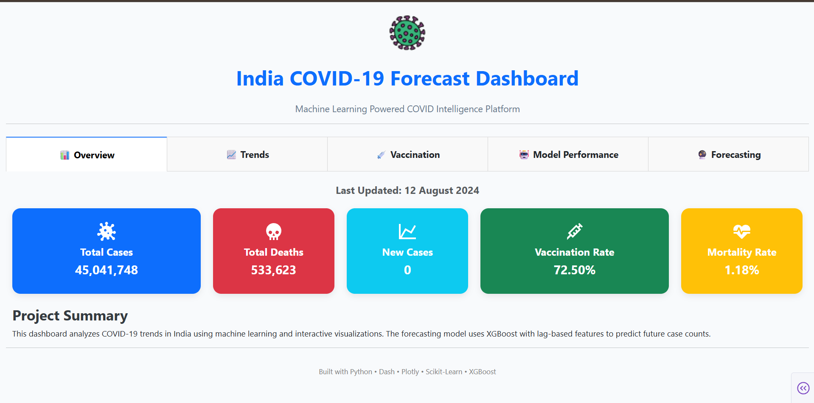
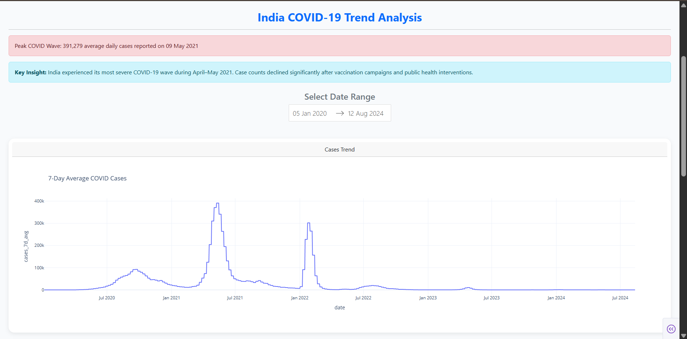
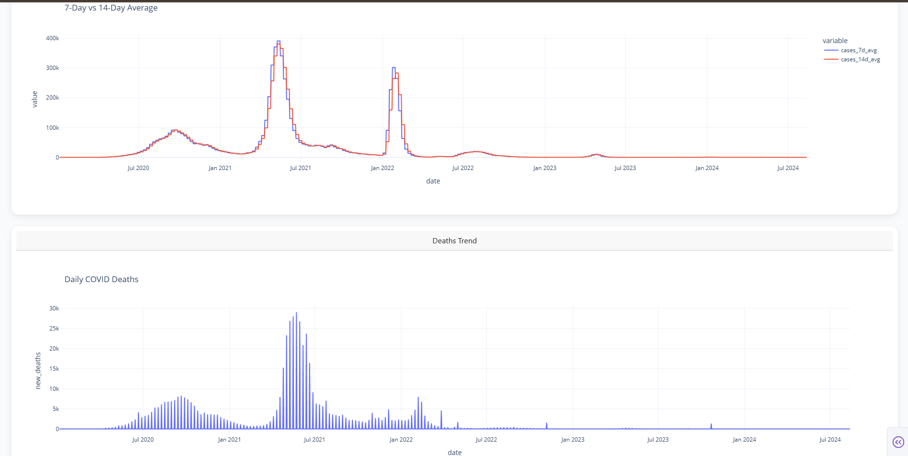
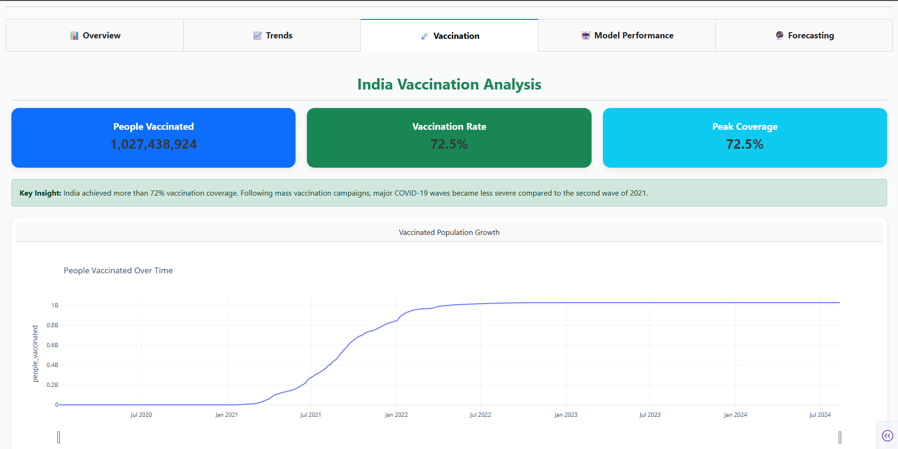
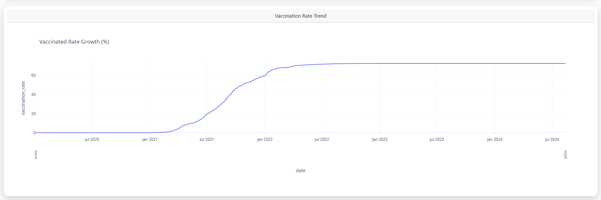
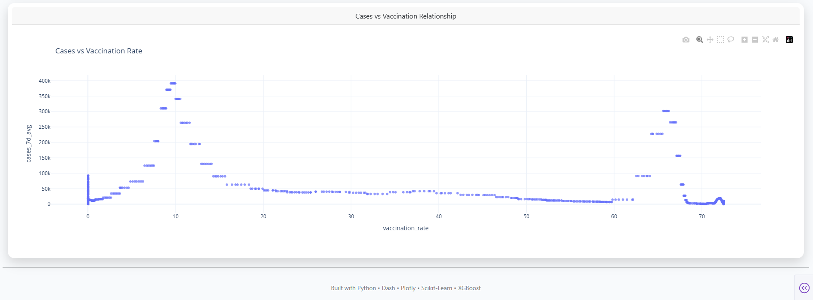
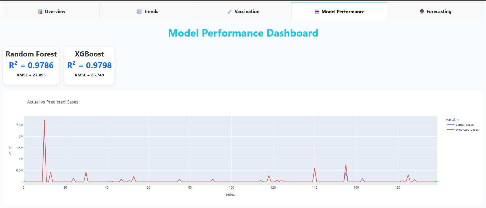
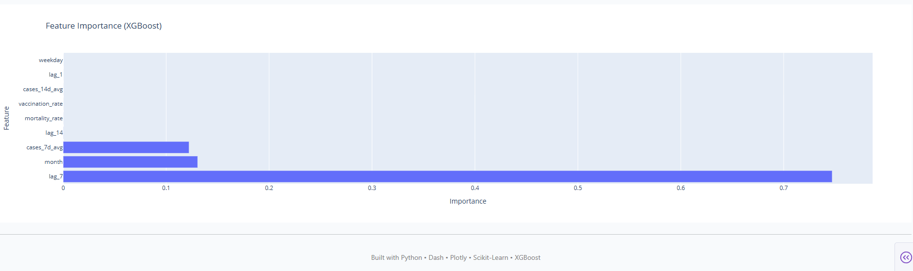
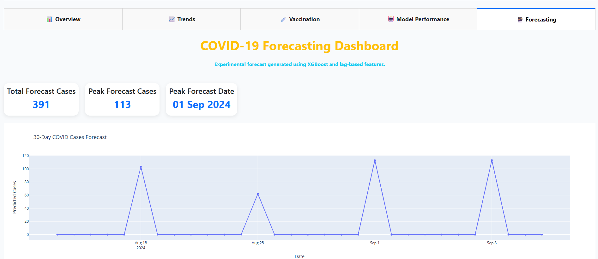
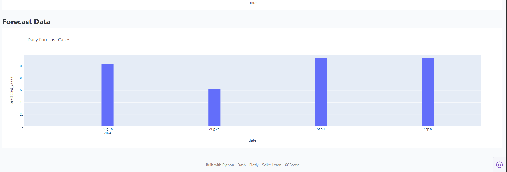

# 🇮🇳 India COVID-19 Analytics & Forecast Dashboard

## 📌 Project Overview

The India COVID-19 Analytics & Forecast Dashboard is an end-to-end Data Science and Machine Learning project designed to analyze COVID-19 trends, vaccination progress, mortality rates, and forecast future case counts in India.

The project combines data engineering, exploratory data analysis (EDA), machine learning, forecasting, and interactive dashboard development into a single production-style analytics platform.

The dashboard enables users to:

* Monitor COVID-19 trends over time
* Analyze vaccination progress
* Explore mortality and infection patterns
* Compare machine learning model performance
* Visualize future COVID-19 case forecasts
* Interact with dynamic charts and filters

---

# 🚀 Project Features

### 📊 Interactive Dashboard

Built using:

* Python
* Dash
* Plotly
* Bootstrap

Dashboard Pages:

1. Overview
2. Trends Analysis
3. Vaccination Insights
4. Model Performance
5. Forecasting

---

### 🤖 Machine Learning Models

Implemented and evaluated:

#### Random Forest Regressor

Performance:

* MAE: 3,056.72
* RMSE: 27,495.37
* R² Score: 0.9786

#### XGBoost Regressor

Performance:

* MAE: 2,948.94
* RMSE: 26,749.00
* R² Score: 0.9798

🏆 Best Model: XGBoost

---

### 🔮 Forecasting

Generated future COVID-19 case forecasts using:

* Lag Features
* Moving Averages
* Vaccination Rate
* Mortality Rate
* XGBoost Regression

Forecast results are visualized through interactive dashboard components.

---

# 📂 Project Structure

```text
India_Covid-19_AnalyticsDashboard/

│
├── data/
│   ├── evaluation/
│   ├── processed/
│   ├── predictions/
│   └── forecast/
│
├── models/
│   ├── random_forest_model.pkl
│   └── xgboost_model.pkl
│
├── notebooks/
│   |── EDA.ipynb
│   └── Model_Analysis.ipynb
│
├── src/
│   ├── preprocessing.py
│   ├── model_evaluation.py
│   ├── visualize_predictions.py
│   ├── train_random_forest.py
│   ├── train_xgboost.py
│   └── generate_forecast.py
│
├── dashboard/
│   ├── app.py
│   ├── pages/
│   └── assets/
│
├── images/
│   ├── overview.png
│   ├── trends1.png
│   ├── trends2.png
│   ├── vaccination1.png
│   ├── vaccination2.png
│   ├── vaccination3.png
│   ├── performance1.png
│   ├── performance2.png
│   ├── forecasting1.png
│   └── forecasting2.png

│
├── requirements.txt
├── README.md
```

---

# 📈 Dataset Information

Source:

Our World in Data COVID-19 Dataset

Data includes:

* Total Cases
* New Cases
* Total Deaths
* New Deaths
* Population
* Vaccination Statistics
* Country Information
* Time-Series Records

After preprocessing, an India-specific dataset was created for focused analysis and modeling.

---

# 🛠 Data Preprocessing

Steps performed:

### Data Cleaning

* Removed aggregated regions
* Handled missing values
* Converted date columns
* Sorted records chronologically

### Feature Engineering

Created:

#### Mortality Rate

Mortality Rate = (Total Deaths / Total Cases) × 100

#### Vaccination Rate

Vaccination Rate = (People Vaccinated / Population) × 100

#### Rolling Features

* 7-Day Moving Average
* 14-Day Moving Average

#### Time Features

* Year
* Month
* Day
* Weekday

---

# 📊 Exploratory Data Analysis

Key Findings:

### COVID Waves

India experienced multiple COVID-19 waves, with the largest outbreak occurring during April–May 2021.

### Vaccination Impact

As vaccination coverage increased, infection growth rates became significantly lower.

### Mortality Trend

Mortality rates remained relatively low compared to total infection counts and showed a declining trend over time.

### Data Distribution

The dataset was highly right-skewed due to pandemic peaks, making feature engineering essential for machine learning performance.

---

# 🤖 Machine Learning Pipeline

### Target Variable

```python
new_cases
```

### Features

```python
lag_1
lag_7
lag_14

cases_7d_avg
cases_14d_avg

vaccination_rate
mortality_rate

month
weekday
```

### Data Split

```python
train_test_split(
    test_size=0.2,
    random_state=42
)
```

---

# 📈 Feature Importance (XGBoost)

| Feature          | Importance |
| ---------------- | ---------: |
| lag_7            |     74.71% |
| month            |     13.05% |
| cases_7d_avg     |     12.21% |
| lag_14           |      0.02% |
| mortality_rate   |        ~0% |
| vaccination_rate |        ~0% |
| cases_14d_avg    |        ~0% |
| lag_1            |         0% |
| weekday          |         0% |

### Insight

COVID case counts were primarily influenced by:

* Previous week's cases (lag_7)
* Monthly seasonality
* Recent infection trends (7-Day Average)

---

# 📷 Dashboard Screenshots

## Overview



---

## Trends Analysis




---

## Vaccination Insights





---

## Model Performance




---

## Forecasting




---

# 💻 Installation

Clone the repository:

```bash
git clone https://github.com/Abhilash0079/MachineLearningProjects/india-covid-analytics-dashboard.git
```

Navigate into the project:

```bash
cd india-covid-analytics-dashboard
```

Install dependencies:

```bash
pip install -r requirements.txt
```

Run the dashboard:

```bash
python dashboard/app.py
```

---

# 🧰 Technologies Used

### Programming

* Python

### Data Analysis

* Pandas
* NumPy

### Machine Learning

* Scikit-Learn
* XGBoost

### Visualization

* Plotly
* Dash

### Dashboard

* Dash Bootstrap Components

### Model Persistence

* Joblib

---

# 📌 Future Improvements

* Real-time COVID API integration
* Advanced forecasting models (Prophet/LSTM)
* Automated model retraining
* Cloud deployment
* User authentication
* Geographic heat maps

---

# 👨‍💻 Author

Abhilash Kumar

Aspiring Data Scientist | Machine Learning Enthusiast | Data Analytics Professional

Skills:

Python • SQL • Power BI • Machine Learning • Data Visualization • Dashboard Development • Statistical Analysis

---

⭐ If you found this project useful, consider giving it a star on GitHub.
